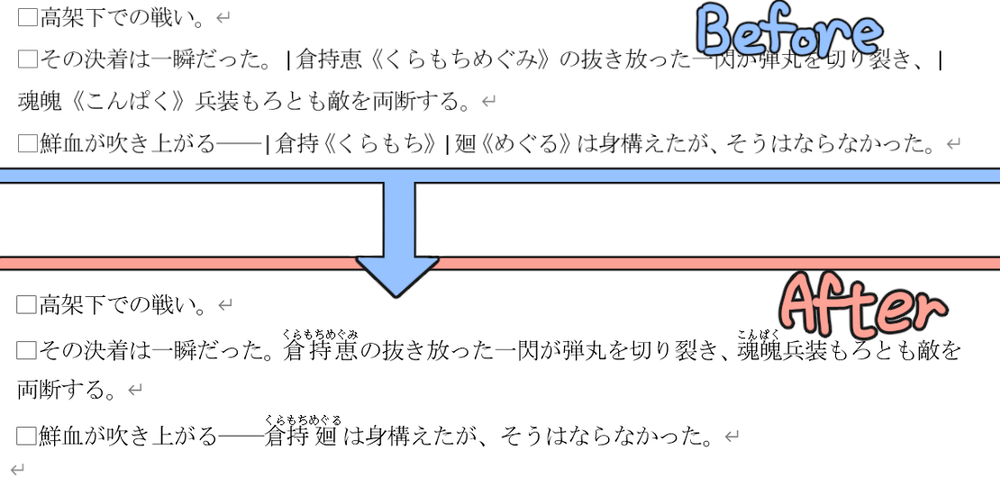

# conv-ruby-on-docx

カクヨム記法で示されたルビをWordのルビにするツールです。

だいたいこんな感じのことができます（文章は拙作[『誰が為の歴史改変』](https://note.com/msattova/n/n5981d867920d?magazine_key=mb9a82abba305)より）

開発中につき、様々な問題を抱えています。ご了承下さい。

## プログラムの実行に必要なもの

python: ver3.10以降

モジュールやライブラリ等についてはrequirements.txtを参照してください。

なお、Releasesからexeファイルをダウンロードして実行する場合は、インストールしなくてはいけないものはありません。

## 使い方(GUI)

`py gui.py`を実行してください。

### exeファイルを利用する場合

exeファイルをダブルクリックしてください。

## 使い方(CUI)

`py main.py input.docx`

`input.docx`はカクヨム記法でルビを振ったdocxファイルです。

このプログラムを実行するとカクヨム記法でルビを振った箇所がWordのルビに変換されたファイル`out.docx`が生成されます。

### 利用上の注意点

* ~~変換元のdocxファイルの解析が上手くいかなる可能性があるため、Wordファイル上での編集作業は極力避けてください。**別のツール（テキストエディタ等）で書いた文章をWord上にコピペすることを推奨します**。~~ → （おそらく）解決しました。
* 本プログラムを実行によって発生した損害について、本プログラムの製作者は一切の責任を負いません

## 今後のアップデート予定

* OSごとにルビのフォント設定を変更 （issue #1）
* ~~行頭の空白文字が削除される問題の解決 (issue #3)~~
* ~~`漢字《かんじ》`記法への対応（issue #6）~~
* ~~`《《傍点を振る》》`記法への対応~~
* 小説の文章が書かれたtxtファイルとテンプレートdocxファイルを入力として受け取ってdocxファイルを出力するような使い方もできるようにする（pandocみたいな感じ）
* ~~GUI化する~~
* ~~exeファイルにする~~
